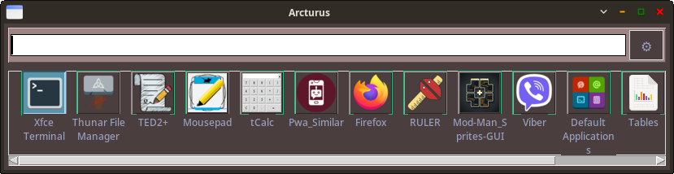

# Arcturus Launcher

<p align="center">
  
</p>

Arcturus — это легковесный и настраиваемый лаунчер приложений для Linux, написанный на Tcl/Tk. Лаунчер обеспечивает быстрый доступ к приложениям с функциями нечеткого поиска, категоризации и возможностью закрепления часто используемых программ.

Скриншот програмы.




## ✨ Особенности

- **Быстрый поиск** — мгновенный поиск приложений по мере ввода
- **Закрепление иконок** — сохранение часто используемых приложений для быстрого доступа
- **Настраиваемый интерфейс** — изменение цветов, шрифтов, размеров иконок и отступов
- **Категоризация** — поддержка стандартных категорий приложений Linux (собирает все категории в один кэш для создания единой ленты...)
- **Управление с клавиатуры** — полная навигация и запуск приложений без использования мыши
- **Эффективное кэширование** — быстрый старт и минимальное потребление ресурсов
- **Контекстные меню** — дополнительные действия для приложений через долгое нажатие
- **Поддержка терминальных приложений** — автоматическое определение и запуск в подходящем эмуляторе терминала

## 🔧 Установка

### Зависимости

Перед установкой убедитесь, что у вас установлены следующие пакеты:

- Tcl/Tk 8.5 или выше
- ImageMagick (для обработки иконок)
- icoutils (для работы с иконками в формате .ico)

#### Debian/Ubuntu/Mint:
```bash
sudo apt-get install tcl tk tcllib tklib imagemagick icoutils
```

#### Fedora:
```bash
sudo dnf install tcl tk tcllib tklib ImageMagick icoutils
```

#### Arch Linux:
```bash
sudo pacman -S tcl tk tcllib tklib imagemagick icoutils
```

### Установка лаунчера

1. Скачайте из репозитория
arcturus_018.tcl (если у вас пользователь live , запускаем как есть если у вас пользователь с другим именем то в скрипте /home/live следует заменить на вашего  )

config.conf

l_Arcturus.sh

2. Перейдите в удобную для вас директорию проекта, куда вы его сохранили, у меня это /home/live/.local/bin/Arcturus/

```bash
cd /home/live/.local/bin/Arcturus/
```

3. Сделайте скрипт исполняемым:
```bash
chmod +x ./arcturus_018.tcl 
а также 
chmod +x ./l_Arcturus.sh
```
не забудьте соотнести поменять пути до вашего пользователя в скриптах

4. Запустите лаунчер:
```bash
./l_Arcturus.sh
```

## 📖 Использование

### Основные функции

- **Поиск приложений**: начните вводить название приложения в поле поиска
- **Запуск приложения**: кликните на иконку или используйте клавиатуру для навигации и Enter для запуска
- **Закрепление приложения**: удерживайте клик на иконке и выберите "Закрепить" в контекстном меню
- **Управление закрепленными**: через настройки (кнопка ⚙) доступно управление закрепленными иконками
- **Удаление приложения из списка**: нажмите правую кнопку мыши на иконке

### Клавиатурная навигация

- **Стрелка вниз**: перейти с поля поиска к иконкам
- **Стрелка вверх**: вернуться к полю поиска
- **Стрелки влево/вправо**: навигация между иконками
- **Enter**: запустить выбранное приложение
- **Escape**: очистить поле поиска или закрыть приложение

### Настройка внешнего вида

Нажмите кнопку ⚙ для доступа к настройкам:

- **Цвета**: изменение цвета фона, поиска и текста
- **Шрифт**: выбор семейства шрифта и размера
- **Отображение**: настройка отступов между иконками
- **Управление кэшем**: обновление кэша приложений
- **Закрепленные иконки**: управление закрепленными приложениями

## 🔄 Обновление кэша

Если вы установили новые приложения или изменили существующие, вы можете обновить кэш приложений:

1. Откройте настройки, нажав кнопку ⚙
2. Нажмите "Обновить кэш приложений"

Альтернативно, вы можете обновить кэш из командной строки:

```bash
./arcturus_018.tcl  --update-cache
```

## 🛠️ Настройка

### Файлы конфигурации

Arcturus использует следующие файлы конфигурации:

- `config.conf` - основные настройки интерфейса
- `.launcher_pinned` - список закрепленных приложений
- `.launcher_icon_cache` - кэш информации об иконках

Все файлы конфигурации хранятся в той же директории, что и исполняемый файл лаунчера.

### Категории приложений

Лаунчер поддерживает стандартные категории приложений Linux:

- **Все** - все доступные приложения
- **Network** - сетевые приложения
- **WebBrowser** - веб-браузеры
- **Office** - офисные приложения
- **System** - системные утилиты
- И другие стандартные категории (в самом лаунчере категории не отображаются, его смысл минимализм и скорость доступа к приложению)

## 🤝 Вклад в проект

Вклады в проект приветствуются! Вы можете:

1. Форкнуть репозиторий
2. Создать новую ветку (`git checkout -b feature/amazing-feature`)
3. Закоммитить ваши изменения (`git commit -m 'Add some amazing feature'`)
4. Отправить ветку (`git push origin feature/amazing-feature`)
5. Открыть Pull Request

## 📜 Лицензия

Этот проект распространяется под лицензией GPL v 3.0 . См. файл `LICENSE` для получения дополнительной информации.

## 👨‍💻 Автор

**totiks2012** - [GitHub](https://github.com/totiks2012)

## 🙏 Благодарности

- Tcl/Tk сообществу за отличный язык и инструментарий
- Сообществу Linux за стандартизацию файлов .desktop
- Всем пользователям и контрибьюторам проекта

---

<p align="center">
  <small>Arcturus Launcher v0.18 | 2025</small>
</p>
